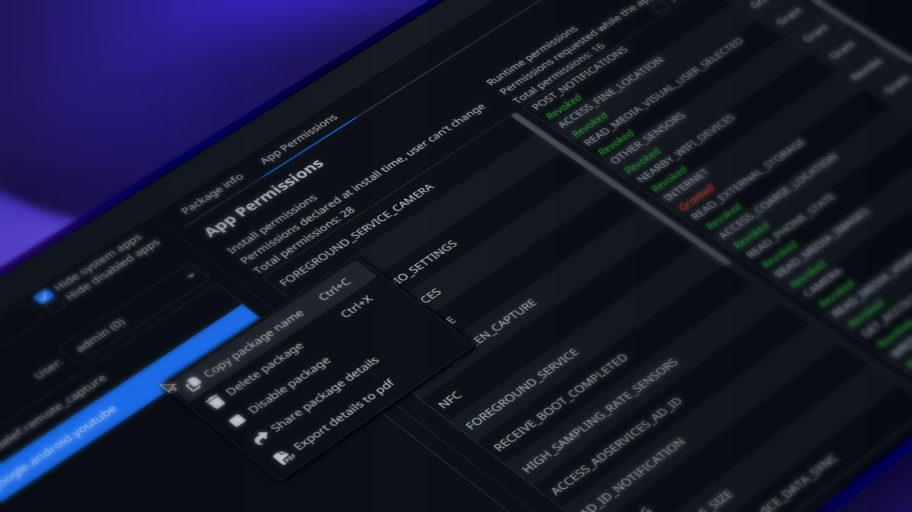

# AndroidToolkit

Modern open-source Android control toolkit powered by ADB.

Cross-platform support for Windows, macOS, and Linux.

## Features

- Control Android devices with ADB
- Disable, enable and uninstall apps
- Control app permissions
- Device information viewer
- Modern desktop UI with AtlantaFX
- Cross-platform desktop support

## Tech Stack

- Java 25
- JavaFX
- Android Debug Bridge (ADB)

### Supported Platforms

- Windows
- macOS
- Linux

## Roadmap
- [x] Delete, disable apps
- [x] Grant, revoke app permissions
- [x] View all android users
- [ ] Wireless ADB support
- [ ] Install APK
- [ ] Logcat viewer
- [ ] More detailed device monitor

